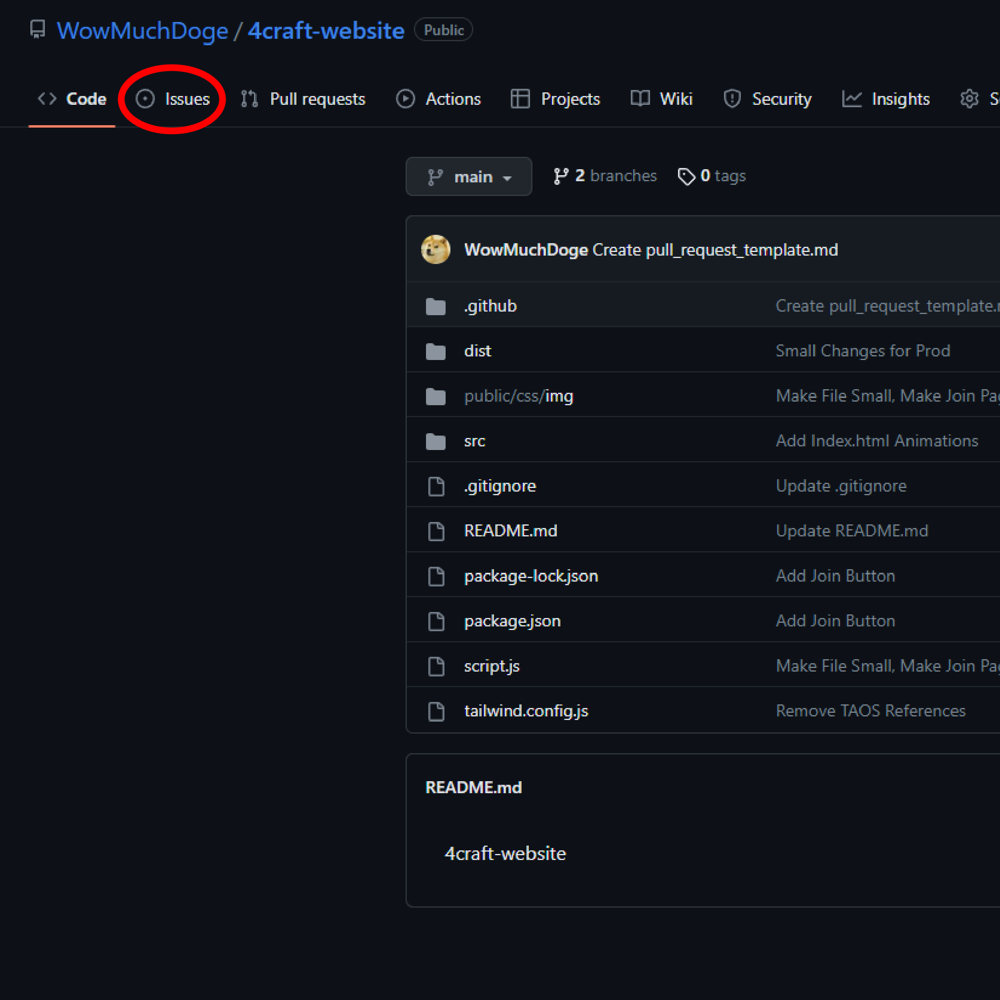
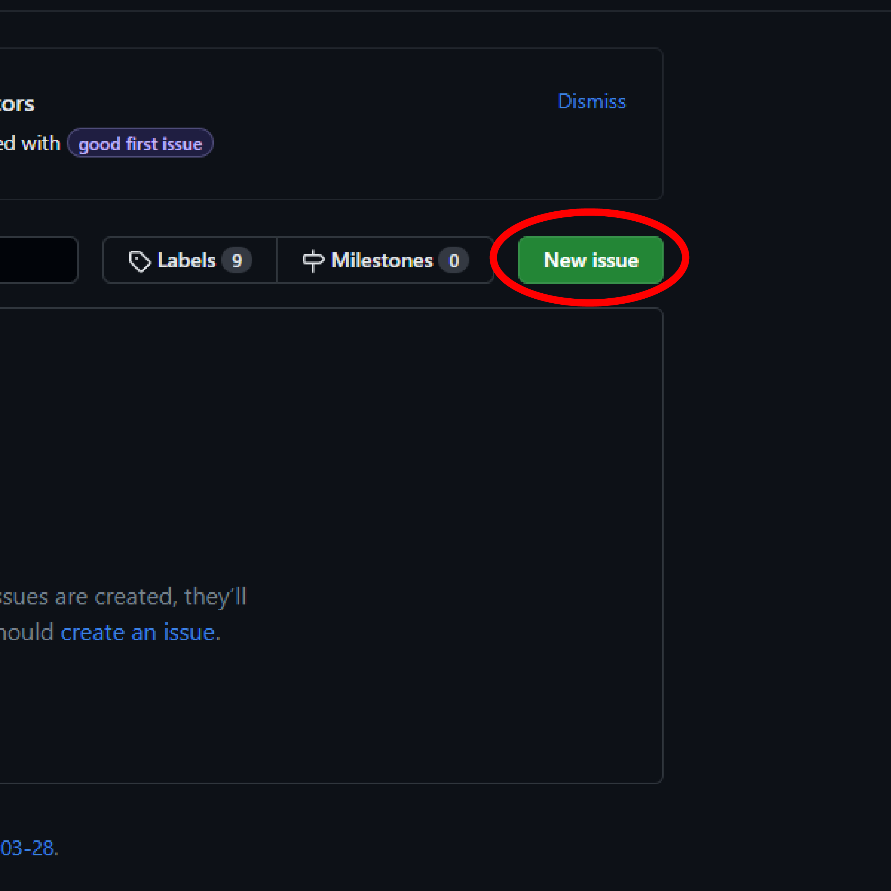

# Description

This is the source code for the [4craft website](https://4craft.net), which is the website for the 4craft Minecraft server. 4craft is a multiplayer paper Minecraft server for both Bedrock and Java versions of Minecraft. Anybody is free to make any code changes to this website and submit a pull request. Doing this will be covered in the next section.

# Table of Contents

- [Project Description](#description)
- [Making Changes](#making-changes)
  - [Opening Issues](#opening-issues)
  - [Making Pull Requests](#making-pull-requests)
- 
- [License](#license)

# Making Changes

## Opening Issues
   Issues are import to continue improving the site. Make sure you keep your issues appropriate and useful to improving the site. Issues do not have to be just about the code, but could be commenting, this README, etc. Please do not send issues about the Minecraft server itself. To create an issue, you cann follow the steps below: 
  1. Open the repoistory and click "Issues"
   
        

  2. Click New Issue

        
  3. Choose what type of issue you would like to open.
  4. Follow the template and submit the issue.

## Making Pull Requests
*All pull requests must close issues*  
    A pull request is a way for contributors to suggest changes before merging it to the main branch. There is a pull request tepmlate that you should use to give an outline of your pull request. For more information about pull requests, visit https://docs.github.com/en/pull-requests/collaborating-with-pull-requests/proposing-changes-to-your-work-with-pull-requests/about-pull-requests

   To make a pull request, follow these steps:

   1. Create a fork of this repository
   2. Make your changes to the code
   3. Go to the pull requests tab on the repository and select "compare across forks"
   4. Select "Create pull request" and fill out the template
   5. Once you are completed, select "Create pull request"
### There you go! I will review your pull request and it could get merged into the website.

# Dependencies
  This project uses Nodejs, Prettier, and Tailwindcss

# License (MIT)
   Permission is hereby granted, free of charge, to any person obtaining a copy
   of this software and associated documentation files (the "Software"), to deal
   in the Software without restriction, including without limitation the rights
   to use, copy, modify, merge, publish, distribute, sublicense, and/or sell
   copies of the Software, and to permit persons to whom the Software is
   furnished to do so, subject to the following conditions:

   The above copyright notice and this permission notice shall be included in all
   copies or substantial portions of the Software.

   THE SOFTWARE IS PROVIDED "AS IS", WITHOUT WARRANTY OF ANY KIND, EXPRESS OR
   IMPLIED, INCLUDING BUT NOT LIMITED TO THE WARRANTIES OF MERCHANTABILITY,
   FITNESS FOR A PARTICULAR PURPOSE AND NONINFRINGEMENT. IN NO EVENT SHALL THE
   AUTHORS OR COPYRIGHT HOLDERS BE LIABLE FOR ANY CLAIM, DAMAGES OR OTHER
   LIABILITY, WHETHER IN AN ACTION OF CONTRACT, TORT OR OTHERWISE, ARISING FROM,
   OUT OF OR IN CONNECTION WITH THE SOFTWARE OR THE USE OR OTHER DEALINGS IN THE
   SOFTWARE.